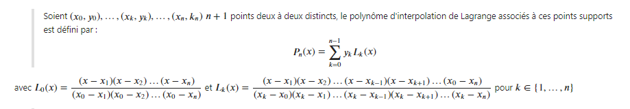

# TP2: Interpolation Numérique
>
>
## Objectif:
> En analyse numérique, une fonction f inconnue explicitement est souvent
>
> * connue seulement en certains points x0, x1, ..., xn ;
>
> * ou évaluable uniquement au moyen de l’appel a un code couteux.
> Mais dans de nombreux cas, on a besoin d’effectuer des opérations (dérivation, intégration,...) sur la fonction f.
> 
> On cherche donc a reconstruire f par une autre fonction fr simple et facile a evaluer a partir
> des données discr etes de f. On espere que le modele f' ne sera pas trop éloigné de la fonction f aux autres points.
>

> **Donc on va s’intéressé dans ce TP a la reconstruction de f par des polynômes**
>
## Polynome d'interpolation de Lagrange: 

> <h3 style="color:SlateBlue;"> un inconvénient de l’interplation de Lagrange est lorsqu’on ajoute un point xN+1 aux points existants X0,X1, · ·  
>, Xn , on a recours à recalculer tous les élements Li pour chaque i = 0, · · · , N+1,c’est a dire, de répeter tout le travail et donc une perte 
>de temps</h3> 

## Phenomène de Runge:
> **Dans le domaine mathématique de l'analyse numérique, le phénomène de Runge se manifeste dans le contexte de l'interpolation polynomiale, en particulier l'interpolation de Lagrange. Avec certaines fonctions (même analytiques), l'augmentation du nombre n de points d'interpolation ne constitue pas nécessairement une bonne stratégie d'approximation.**
### Exercice 2 :

> **On a vu donc que le phénomène de Runge qui se traduit par une mauvaise interpolation,lorsque l'on augmente le degré du polynôme d'interpolation de Lagrange.**

## Formule de Newton 

> **Cette méthode ne différe de l’interpolation lagrangienne que par la maniére dont le polynôme est calculé, polynôme d’interpolation qui en résulte est le même.**

### Exercice 3 :

