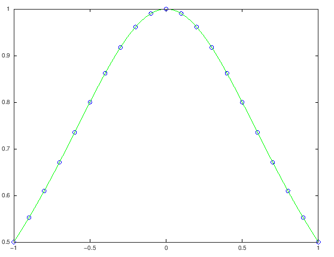
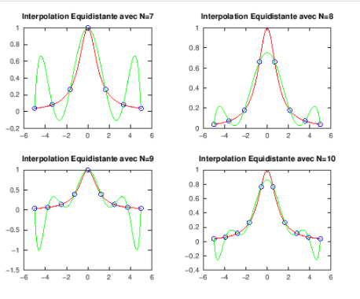
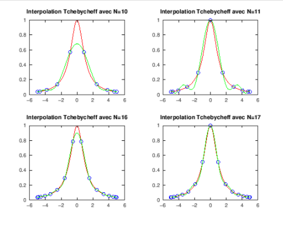

# TP2: Interpolation Numérique
>
>
## Objectis
> En analyse numérique, une fonction f inconnue explicitement est souvent
>
> – connue seulement en certains points x0, x1, ..., xn ;
>
> – ou évaluable uniquement au moyen de l’appel a un code couteux.
> Mais dans de nombreux cas, on a besoin d’effectuer des opérations (dérivation, intégration,...) sur la fonction f.
> 
> On cherche donc a reconstruire f par une autre fonction fr simple et facile a evaluer a partir
> des données discr etes de f. On espere que le modele f' ne sera pas trop éloigné de la fonction f aux autres points.
> 

> **Donc on va s’intéressé dans ce TP a la reconstruction de f par des polynômes**
>
## Polynome d'interpolation de Lagrange 
> Soient 
$(x_0,y_0), \ldots,(x_k,y_k),\ldots ,(x_n,k_n)$ $n+1$ points deux à deux distincts, le polynôme d'interpolation de Lagrange associés à ces points supports est défini par :
$$P_n(x)=\sum_{k=0}^{n-1} y_kL_k(x)$$

avec
$L_{0}(x)=\displaystyle\frac{(x-x_1)(x-x_2)\ldots(x-x_{n})}{(x_0-x_1)(x_0-x_2)\ldots(x_0-x_{n})}$ et $L_{k}(x)=\displaystyle\frac{(x-x_1)(x-x_2)\ldots(x-x_{k-1})(x-x_{k+1})\ldots(x_0-x_{n})}{(x_k-x_0)(x_k-x_1)\ldots(x_k-x_{k-1})(x_k-x_{k+1})\ldots(x_k-x_{n})}$ pour $k\in \{1,\ldots,n\}$

## Phenomène de Runge 
### Exercice 2 :

### Exercice 3 :

